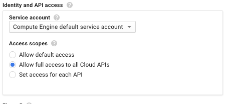
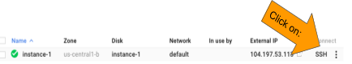

# Create a Compute Engine Instance

## Overview

In this lab, you spin up a virtual machine, configure its security, and access it remotely.

### What you learn

In this lab, you:

* Create a Compute Engine instance with the necessary Access and Security
* SSH into the instance

## Introduction

In this lab, you spin up a virtual machine, configure its API access, and log into it remotely.  You will rarely work with Compute Engine instances at such a low-level, but knowing the foundations of GCP can be helpful in troubleshooting.

![[/fragments/startqwiklab]]

## Task 1: Create Compute Engine instance with the necessary API access

To create a Compute Engine instance:

1. In the GCP Console, on the __Navigation menu__ (), click __Compute Engine__ Or tape __Compute Engine__ in the __Search Bar__.

2. Click __Create__ and wait for a form to load. You will need to change some options on the form that comes up.

3. For __Name__, I choosed __my-vm-1__, for __Region__, I select __europe-west1__, and for __Zone__, select __europe-west1-b__.

4. For __Identity and API access__, in __Access scopes__, select __Allow full access to all Cloud APIs__:

    
    
    You can click on __Ligne de commande équivalant (fr)__ or __.Command Line Equivalent__.
    ```
    gcloud compute instances create my-vm-1 \ 
    --project=gcp-labs-318508 \
    --zone=europe-west1-b \
    --machine-type=e2-medium \
    --network-interface=network-tier=PREMIUM,subnet=boni1 \
    --maintenance-policy=MIGRATE \
    --service-account=427881976472-compute@developer.gserviceaccount.com \
    --scopes=https://www.googleapis.com/auth/cloud-platform \
    --create-disk=auto-delete=yes,boot=yes,device-name=my-vm-1,\
    image=projects/debian-cloud/global/images/debian-9-stretch-v20220317,mode=rw,size=10,\
    type=projects/gcp-labs-318508/zones/europe-west1-b/diskTypes/pd-balanced --reservation-affinity=any
    ```

5. Click __Create__.

## Task 2: SSH into the instance

When the instance is created, you can remotely access your Compute Engine instance using Secure Shell (SSH):

1. When the instance you just created is available, click __SSH__:

    

    __Note__: SSH keys are automatically transferred - allowing you to ssh directly from the browser - with no extra software needed.

2. To view information about the Compute Engine instance you just launched, type the following into your SSH terminal:

    ```
    cat /proc/cpuinfo
    ```

## Task 3: Install software

1. In the SSH terminal, type the following:

    ```
    sudo apt-get update
    sudo apt-get -y -qq install git
    ```

2. Verify that git is now installed:

    ```
    git --version
    ```

3. Exit from the session by typing:

    ```
    exit
    ```

![[/fragments/endqwiklab]]

Last Updated Date : 2019-03-06

Last Tested Date : 2019-03-06

![[/fragments/copyright]]
