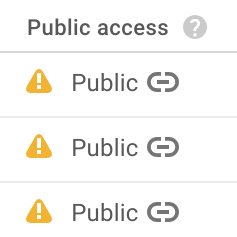

# Interact with Google Cloud Storage  

## Overview

In this lab, you spin up a virtual machine, configure its security, and access it remotely.

### What you learn

In this lab, you will:

* Create a Compute Engine instance with the necessary Access and Security
* SSH into the instance
* Install the software package Git (for source code version control)
* Ingest data into a Compute Engine instance
* Transform data on the Compute Engine instance
* Store the transformed data on Cloud Storage
* Publish Cloud Storage data to the web

## Introduction

In this lab, you spin up a virtual machine, configure its API access, and log into it remotely.  You will rarely work with Compute Engine instances at such a low-level, but knowing the foundations of GCP can be helpful in troubleshooting.

You will then carry out the steps of an ingest-transform-and-publish data pipeline manually:

* Ingest data into a Compute Engine instance
* Transform data on the Compute Engine instance
* Store the transformed data on Cloud Storage
* Publish Cloud Storage data to the web

You will use real-time earthquake data published by the United States Geological Survey (USGS).

![[/fragments/startqwiklab]]

## Task 1: Create Compute Engine instance with the necessary API access

To create a Compute Engine instance:

1. In the GCP Console, on the __Navigation menu__ (), click __Compute Engine__.

2. Click __Create__ and wait for a form to load. You will need to change some options on the form that comes up.

3. For __Name__, leave the default value, for __Region__, select __us-central1__, and for __Zone__, select __us-central1-a__.

4. For __Identity and API access__, in __Access scopes__, select __Allow full access to all Cloud APIs__:

    

5. Click __Create__.

## Task 2: SSH into the instance

When the instance is created, you can remotely access your Compute Engine instance using Secure Shell (SSH):

1. When the instance you just created is available, click __SSH__:

    

    __Note__: SSH keys are automatically transferred - allowing you to ssh directly from the browser - with no extra software needed.

2. To view information about the Compute Engine instance you just launched, type the following into your SSH terminal:

    ```bash
    cat /proc/cpuinfo
    ```

## Task 3: Install software and Ingest USGS data

1. In the SSH terminal, type the following:

    ```bash
    sudo apt-get update
    sudo apt-get -y -qq install git
    ```

2. Verify that git is now installed:

    ```bash
    git --version
    ```

3. On the command-line, type:

    ```bash
    git clone https://github.com/GoogleCloudPlatform/training-data-analyst
    ```

    This downloads the code from github.

    __Note__: If you get a git authorization error, it is likely that the github URL has a typo in it.  Please copy and paste the above code.

4. Navigate to the folder corresponding to this lab:

    ```bash
    cd training-data-analyst/CPB100/lab2b
    ```

5. Examine the ingest code using __less__:

    ```bash
    less ingest.sh
    ```

    The __less__ command allows you to view the file (Press the __spacebar__ to scroll down; the letter __b__ to go back a page; the letter __q__ to quit).

    The program __ingest.sh__ downloads a dataset of earthquakes in the past 7 days from the US Geological Survey.  Where is this file downloaded? To disk or to Cloud Storage?

6. Run the ingest code:

    ```bash
    bash ingest.sh
    ```

7. Verify that some data has been downloaded:

    ```bash
    head earthquakes.csv
    ```

    The __head__ command shows you the first few lines of the file.

## Task 4: Transform the data

You will use a Python program to transform the raw data into a map of earthquake activity:

The transformation code is explained in detail in this notebook:
[https://github.com/GoogleCloudPlatform/datalab-samples/blob/master/basemap/earthquakes.ipynb](https://github.com/GoogleCloudPlatform/datalab-samples/blob/master/basemap/earthquakes.ipynb)

Feel free to read the narrative to understand what the transformation code does.  The notebook itself was written in Datalab, a GCP product that you will learn to use in this course.

1. First, install the necessary Python packages on the Compute Engine instance. In your SSH terminal, type the following:

    ```bash
    bash install_missing.sh
    ```

2. Run the transformation code:

    ```bash
    python3 transform.py
    ```

3. You will notice a new image file if you list the contents of the directory:

    ```bash
    ls -l
    ```

## Task 5: Create bucket

Create a bucket using the GCP console:

1. In the GCP Console, on the __Navigation menu__ (), click __Storage__.

2. Click __Create Bucket__.

3. For __Name__, enter your __Project ID__, then click __Create__. To find your __Project ID__, click the project in the top menu of the GCP Console and copy the value under __ID__ for your selected project.

    Note the name of your bucket. For the rest of this lab, replace `<YOUR-BUCKET>` with your bucket name.

4. Click __Create__.

## Task 6: Store data

To store the original and transformed data in Cloud Storage

1. In your SSH terminal, type the following, replacing `<YOUR-BUCKET>` with the name of the bucket you created in the previous task:

    ```bash
    gsutil cp earthquakes.* gs://<YOUR-BUCKET>/earthquakes/
    ```

2. In the GCP Console, click the bucket name and notice there are three new files present in the __earthquakes__ folder (click __Refresh__ if necessary).

## Task 7: Publish Cloud Storage files to web

 Publish Cloud Storage files to the web with follwing command:

 ```bash
 gsutil acl ch -u AllUsers:R gs://<YOUR-BUCKET>/earthquakes/*
 ```

 From the GCP console, navigate to your cloud storage bucket (click __refresh__ if necessary).

 For __earthquakes.htm__, click __Public link__.

  

  What is the URL of the published Cloud Storage file? How does it relate to your bucket name and content?

  What are some advantages of publishing to Cloud Storage?

  ![[/fragments/endqwiklab]]

  Last Manual Updated Date: 2019-03-06

  Last Tested Date: 2019-03-06

  ![[/fragments/copyright]]
