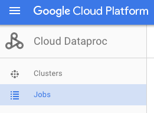
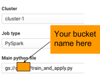

# Recommendations ML with Dataproc

## Overview  

In this lab, you carry out recommendations machine learning using Dataproc.

### What you learn

In this lab, you will:

* Launch Dataproc
* Run SparkML jobs using Dataproc

## Introduction

In this lab, you use Dataproc to train the recommendations machine learning model based on users' previous ratings. You then apply that model to create a list of recommendations for every user in the database.

In this lab, you will:

* Launch Dataproc
* Train and apply ML model written in PySpark to create product recommendations
* Explore inserted rows in Cloud SQL

![[/fragments/startqwiklab]]

## Setup

![[/fragments/cloudshell]]

## Task 1: Create Assets

We start by cloning the code repository, creating a storage bucket in the GCP project and stage some files. These steps are similar to what you did in the previous lab.

1. In Cloud Shell, clone the repo using the following command:

    ```
    git clone https://github.com/GoogleCloudPlatform/training-data-analyst
    ```

    This downloads the code from github.

2. Navigate to the folder corresponding to this lab:

    ```
    cd training-data-analyst/CPB100/lab3a
    ```

3. In the GCP Console, on the __Navigation menu__ (), click __Storage__.

4. Click  __Create bucket__.

5. For __Name__, enter your __Project ID__. Select __Set object-level and bucket-level permissions__ under __Access control model__, then click __Create__. To find your __Project ID__, click the project in the top menu of the GCP Console and copy the value under __ID__ for your selected project.

6. Finally, stage the table definition and data files into Cloud Storage, so that you can later import them into Cloud SQL from Cloud Shell within the lab3a directory by typing the following, replacing `<BUCKET-NAME>` with the name of the bucket you just created:

    ```
    gsutil cp cloudsql/* gs://<BUCKET-NAME>/sql/
    ```

7. From the GCP console, go to Storage, navigate to your bucket and verify that the `.sql` and `.csv` files now exist on Cloud Storage.

## Task 2: Create Cloud SQL instance

To create Cloud SQL instance:

1. In the GCP Console, on the __Navigation menu__ (), click __SQL__ (in the Storage section).

2. Click __Create Instance__.

3. Choose __MySQL__. Click __Next__ if required.

4. For __Instance ID__, type __rentals__.

    

5. Scroll down and specify a root password.  Before you forget, note down the root password (please don't do this in real-life!).

6. Scroll down and click __Set Connectivity__ or Click __Show configuration options__ first (if required), then click __Authorize networks__ > __+Add network__.

    

7. In Cloud Shell, make sure you're in the __lab3a__ directory and find your IP address by typing:

    ```
    bash ./find_my_ip.sh
    ```

8. In the __Add Network__ dialog, enter an optional __Name__ and enter the __IP address__ output in the previous step. Click __Done__.

    

  <aside class="warning"><p>
  <strong>Note</strong>: If you lose your Cloud Shell VM due to inactivity, you will have to reauthorize your new Cloud Shell VM with Cloud SQL. For your convenience, lab3a includes a script called <strong>authorize_cloudshell.sh</strong> that you can run.
  </p>
  </aside>

9. Click __Create__ to create the instance. It will take a minute or so for your Cloud SQL instance to be provisioned.

10. Note down the __Public IP address__ of your Cloud SQL instance (from the browser window).

## Task 3: Create and populate tables

To import table definitions from Cloud Storage:

1. Click __rentals__ to view details about your Cloud SQL instance.

2. Click __Import__.

3. Click __Browse__. This will bring up a list of buckets. Click on the bucket you created, then navigate into __sql__, click __table_creation.sql__, then click __Select__.

4. Click __Import__.

  <aside class="warning"><p>
  <strong>Note</strong>: If <code>.sql</code> or <code>.csv</code> files import fails in first attempt, try again.
  </p>
  </aside>

5. Next, to import CSV files from Cloud Storage, click __Import__.

6. Click __Browse__, navigate into __sql__, click __accommodation.csv__, then click __Select__.

7. Fill out the rest of the dialog as follows:

    For __Database__, select __recommendation_spark__

    For __Table__, type __Accommodation__

    

8. Click __Import__.    

9. Repeat the Import process (steps 5 - 8) for __rating.csv__, but for __Table__, type __Rating__.

## Task 4: Launch Dataproc

To launch Dataproc and configure it so that each of the machines in the cluster can access Cloud SQL:

1. In the GCP Console, on the __Navigation menu__  (), click __SQL__ and note the region of your Cloud SQL instance:

    

    In the above snapshot, the region is `us-central1`.

2. In the GCP Console, on the __Navigation menu__ (), click __Dataproc__ and click __Enable API__ if prompted. Once enabled, click __Create cluster__.

3. Leave the __Region__ as it is i.e. __global__, change the __Zone__ to be in the same region as your Cloud SQL instance. This will minimize network latency between the cluster and the database.

4. For __Master node__, for __Machine type__, select __2 vCPU (n1-standard-2)__.

5. For __Worker nodes__, for __Machine type__, select __2 vCPU (n1-standard-2)__.

6. Leave all other values with their default and click __Create__.  It will take 1-2 minutes to provision your cluster.

7. Note the __Name__, __Zone__ and __Total worker nodes__ in your cluster.

8. In Cloud Shell, navigate to the folder corresponding to this lab and authorize all the Dataproc nodes to be able to access your Cloud SQL instance, replacing `<Cluster-Name>`, `<Zone>`, and `<Total-Worker-Nodes>` with the values you noted in the previous step:

    ```
    cd ~/training-data-analyst/CPB100/lab3b
    bash authorize_dataproc.sh <Cluster-Name> <Zone> <Total-Worker-Nodes>
    ```

    When prompted, type __Y__, then __Enter__ to continue.

## Task 5: Run ML model

To create a trained model and apply it to all the users in the system:

1. Edit the model training file using `nano`:

    ```
    nano sparkml/train_and_apply.py
    ```

2. Change the fields marked #CHANGE at the top of the file (scroll down using the down arrow key) to match your Cloud SQL setup (see earlier parts of this lab where you noted these down), and save the file using __Ctrl+O__ then press __Enter__, and then press __Ctrl+X__ to exit from the file.

3. Copy this file to your Cloud Storage bucket using:

    ```
    gsutil cp sparkml/tr*.py gs://<bucket-name>/
    ```

4. In the __Dataproc__ console, click __Jobs__.

    

5. Click __Submit job__.

6. For __Job type__, select __PySpark__ and for __Main python file__, specify the location of the Python file you uploaded to your bucket.

    

    `gs://<bucket-name>/train_and_apply.py`

7. Click __Submit__ and wait for the job Status to change from `Running` (this will take up to 5 minutes) to `Succeeded`.

    

    If the job `Failed`, please troubleshoot using the logs and fix the errors. You may need to re-upload the changed Python file to Cloud Storage and clone the failed job to resubmit.

## Task 6: Explore inserted rows

1. In the GCP Console, on the __Navigation menu__  (), click __SQL__ (in the Storage section).

2. Click __rentals__ to view details related to your Cloud SQL instance.

3. Under __Connect to this instance__ section, click __Connect using Cloud Shell__. This will start new Cloudshell tab. In Cloudshell tab press __Enter__.

    It will take few minutes to whitelist your IP for incoming connection.

4. When prompted, type the root password you configured, then __Enter__.

5. At the mysql prompt, type:

    ```
    use recommendation_spark;
    ```

    This sets the database in the mysql session.

6. Find the recommendations for some user:

    ```
    select r.userid, r.accoid, r.prediction, a.title, a.location, a.price, a.rooms, a.rating, a.type from Recommendation as r, Accommodation as a where r.accoid = a.id and r.userid = 10;
    ```

    These are the five accommodations that we would recommend to her. Note that the quality of the recommendations are not great because our dataset was so small (note that the predicted ratings are not very high). Still, this lab illustrates the process you'd go through to create product recommendations.

    ![[/fragments/endqwiklab]]

    Last Manual Updated Date: 2019-03-06

    Last Tested Date: 2019-03-06

    ![[/fragments/copyright]]
