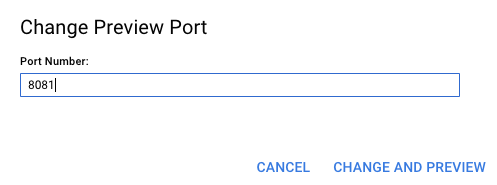
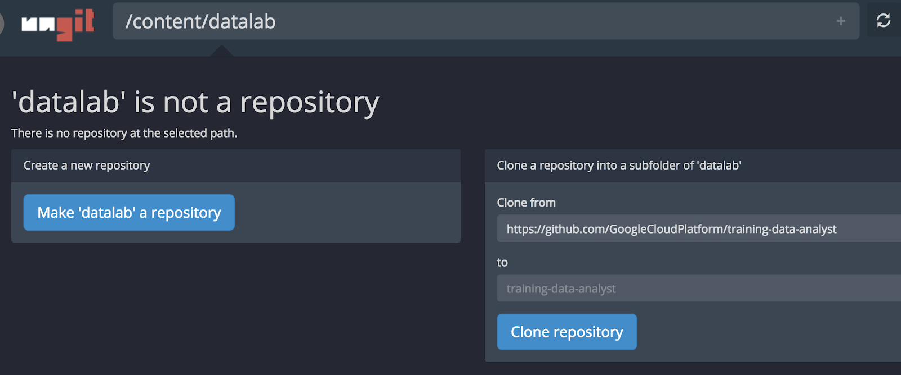

# Carry out ML with Tensorflow

## Overview

In this lab, continue the Datalab notebook from previous lab to create a TensorFlow neural network to predict taxicab demand.

### __What you learn__

In this lab, you:

* Use TensorFlow to create a neural network model to forecast taxicab demand in NYC

## Introduction

In this lab, you will continue to build a demand forecast system using machine learning. In the previous lab, you created a training dataset that consists of the factors that affect taxi demand ("input features") and the actual demand ("target") on days in the past. In this lab, you will use this data to train a TensorFlow neural network that can then predict the demand on days in the future given those features as input.

## Setup

![[/fragments/cloudshell]]

## Task 1: Launch Cloud Datalab

To launch Cloud Datalab:

1. In __Cloud Shell__, type:

  ```
  datalab create bdmlvm --zone us-central1-a
  ```

  Datalab will take about 5 minutes to start.

  `Note: follow the prompts during this process.`

## Task 2: Checkout notebook into Cloud Datalab

If necessary, wait for Datalab to finish launching. Datalab is ready when you see a message prompting you to do a "Web Preview".

1. Click on the __Web Preview__ icon on the top-right corner of the Cloud Shell ribbon. Click on the __Change port__. Switch to port __8081__ using the __Change Preview Port__ dialog box, and then click on __Change and Preview__.

    

    

    Note: The connection to your Datalab instance remains open for as long as the datalab command is active. If the cloud shell used for running the datalab command is closed or interrupted, the connection to your Cloud Datalab VM will terminate. If that happens, you may be able to reconnect using the command `datalab connect bdmlvm` in your new Cloud Shell.

2. In __Datalab__, click on the icon for __Open ungit__ in the top-right ribbon.

    

3. In the Ungit window, select the text that reads __/content/datalab/notebooks__ and remove the __notebooks__ so that it reads __/content/datalab__, then hit __Enter__.

    

4. In the panel that comes up, type the following as the GitHub repository to __Clone from__:

    ```bash
    https://github.com/GoogleCloudPlatform/training-data-analyst
    ```

5. Click  __Clone repository__.

## Task 3: Open a Datalab notebook

1. In the Datalab browser, navigate to __training-data-analyst \> CPB100 \> lab4a \> demandforecast.ipynb__

2. Like in the previous lab, run each cell in the notebook until you reach the section __Machine Learning with Tensorflow__.

3. Continue to run the remaining cells.

4. Read the commentary, Click __Clear | Clear all Cells__, then run the Python snippets (Use __Shift+Enter__ to run each piece of code) in the cell, step by step.

![[/fragments/endqwiklab]]

Last Manual Updated Date: 2019-03-06

Last Tested Date: 2019-03-06

![[/fragments/copyright]]
