# Training with Pre-built ML Models using Cloud Vision API and AutoML


## Overview

*Duration is 1 min*


In this lab, you will experiment with pre-built models so there's no coding. First we'll start with the pre-trained Vision API where we don't need to bring our own data and then we'll progress into AutoML for more sophisticated custom labelling that we need.

### __What you learn__

In this lab, you learn how to:

* Setup API key for ML Vision API
* Invoke the pretrained ML Vision API to classify images
* Review label predictions from Vision API
* Train and evaluate custom AutoML Vision image classification model
* Predict with AutoML on new image


## Setup

![[/fragments/start-qwiklab]]

![[/fragments/cloudshell]]

## Enable Vision API and create API Key

*Duration is 1 min*


To get an API key:

__Step 1__

In your GCP Console, click on the __Navigation menu__ (), select __APIs and services__ and select __Library__.

__Step 2__

In the search box, type __vision__ to find the __Cloud Vision API__ and click on the hyperlink.


__Step 3__

Click __Enable__ if necessary.

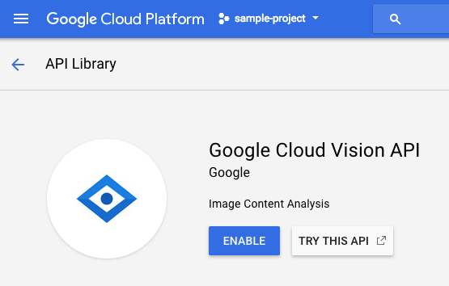

__Step 4__

In your GCP Console, click on the __Navigation menu__ (), select __APIs & Services__ and select __Credentials__.

__Step 5__

If you do not already have an API key, click __Create credentials__ and select __API key__. Once created, copy the API key and then click __Close__.


__Step 6__

In Cloud Shell, export your API key as environment variable. Be sure to replace \<YOUR\_API\_KEY\> with the key you just copied.

```bash
export API_KEY=<YOUR_API_KEY>
```


## Create storage bucket and store data file

*Duration is 2 min*

![[/fragments/create-bucket]]

__Step 1__

Download the image below by right-clicking and saving it locally (save it as cirrus.png):

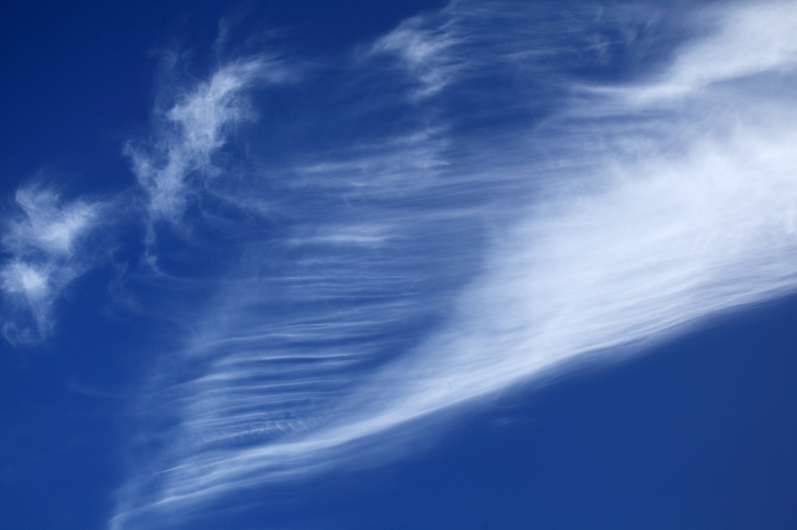

__Step 2__

Upload the file you just downloaded into the storage bucket you just created using the __upload files__ button.

__Step 3__

In Cloud Shell, run the command below to make the file publicly accessible.

```bash
gsutil acl ch -u AllUsers:R gs://<YOUR-BUCKET>/*
```

Click the __Public__ link to confirm the file loads correctly (refresh bucket if needed).


## Label detection with Vision API


__Step 1__

First, you will create a Vision API request in a json file. Using gcloud or your preferred command line editors (nano, vim, or emacs) create a __request.json__ file and inserting the following:

<aside class="special"><p><strong>Note: </strong>Replace <strong>my-bucket-name</strong> with the name of your storage bucket.</p>
</aside>

```json
{
  "requests": [
      {
        "image": {
          "source": {
              "gcsImageUri": "gs://my-bucket-name/cirrus.png"
          }
        },
        "features": [
          {
            "type": "LABEL_DETECTION",
            "maxResults": 10
          }
        ]
      }
  ]
}
```

__Save__ the file.

__Step 2__

The label detection method will return a list of labels (words) of what's in your image. Call the Vision API with curl:

```bash
curl -s -X POST -H "Content-Type: application/json" --data-binary @request.json  https://vision.googleapis.com/v1/images:annotate?key=${API_KEY}
```

Your response should look something like the following:

```json
{
        "responses": [{
                "labelAnnotations": [{
                        "mid": "/m/01bqvp",
                        "description": "sky",
                        "score": 0.9867201,
                        "topicality": 0.9867201
                }, {
                        "mid": "/m/0csby",
                        "description": "cloud",
                        "score": 0.97132415,
                        "topicality": 0.97132415
                }, {
                        "mid": "/m/01g5v",
                        "description": "blue",
                        "score": 0.9683707,
                        "topicality": 0.9683707
                }, {
                        "mid": "/m/02q7ylj",
                        "description": "daytime",
                        "score": 0.9555285,
                        "topicality": 0.9555285
                }, {
                        "mid": "/m/01ctsf",
                        "description": "atmosphere",
                        "score": 0.92822105,
                        "topicality": 0.92822105
                }, {
                        "mid": "/m/0csh5",
                        "description": "cumulus",
                        "score": 0.8386173,
                        "topicality": 0.8386173
                }, {
                        "mid": "/g/11k2xz7mr",
                        "description": "meteorological phenomenon",
                        "score": 0.75660443,
                        "topicality": 0.75660443
                }, {
                        "mid": "/m/026fm63",
                        "description": "calm",
                        "score": 0.72833425,
                        "topicality": 0.72833425
                }, {
                        "mid": "/m/03w43x",
                        "description": "computer wallpaper",
                        "score": 0.6601879,
                        "topicality": 0.6601879
                }, {
                        "mid": "/m/0d1n2",
                        "description": "horizon",
                        "score": 0.63659215,
                        "topicality": 0.63659215
                }]
        }]
}
```

Note that the Vision API does recognize it's an image with SKY and CLOUD but the type of cloud is incorrectly labeled as a cumulus cloud. We need a more specific model with our own labeled training data to get a more accurate model.


## Setup AutoML Vision


AutoML Vision enables you to train machine learning models to classify your images according to your own defined labels. In this section, we will upload images of clouds to Cloud Storage and use them to train a custom model to recognize different types of clouds (cumulus, cumulonimbus, etc.).

__Step 1__

In your GCP Console, click on the __Navigation menu__ (), click on __Vision__.


__Step 2__

In the __Image Classification__ dialog, click __Get started__.

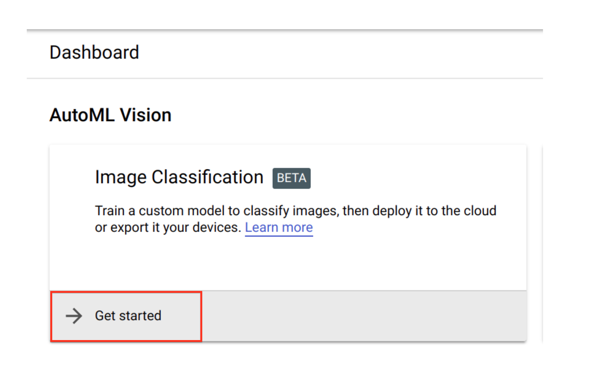

__Step 3__

Select the GCP account created by qwiklabs and allow AutoML access :

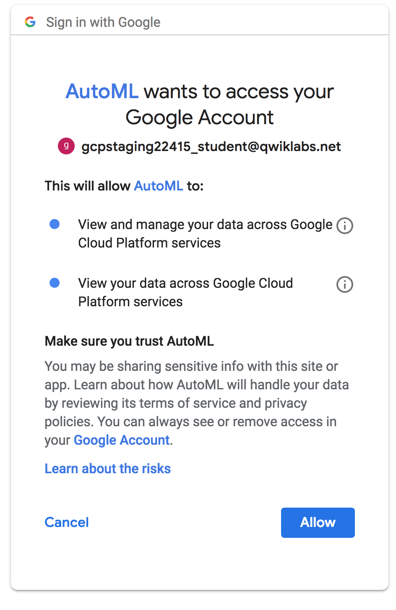

__Step 4__


Next, Click on __Go To Billing__ and choose to __Go to linked billing account__:


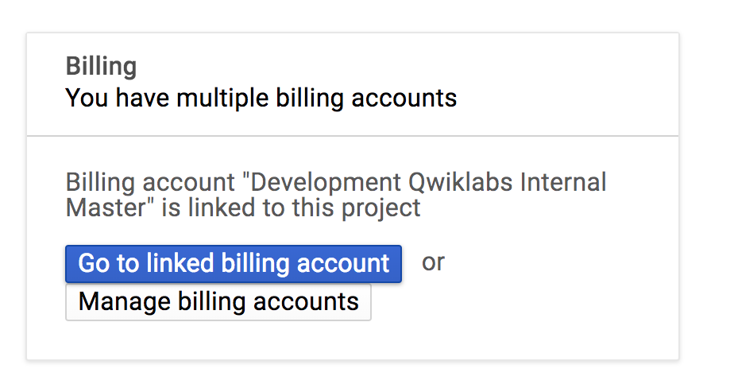

__Step 5__

Confirm the step was successful.


__Step 6__

Now setup the necessary APIs and service accounts by clicking on __Set Up Now__.


__Step 7__

Select the Project ID and click __Continue__.

__Step 8__

You will be redirected on to the AutoML Vision console.

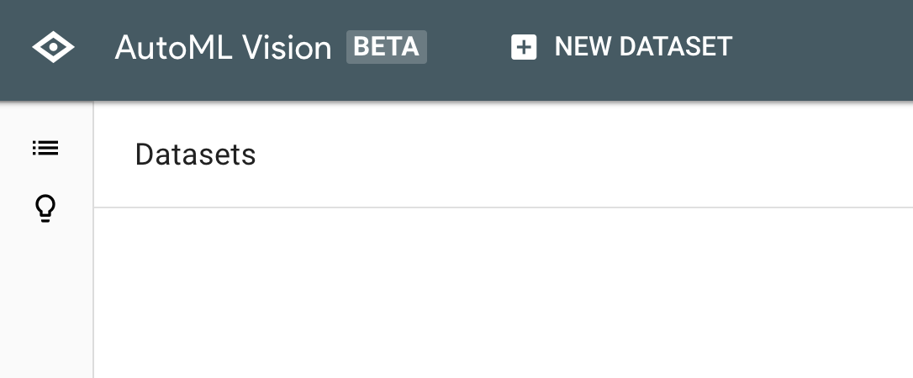


## Stage training files


__Step 1__

Back on your GCP console, check under storage buckets to confirm a new bucket created by AutoML Vision API. The name is similar to your project id, with the suffix *vcm* (for example : *qwiklabs-gcp-dabd0aa7da42381e-vcm*).


Copy the new bucket name so you can use it in the next step.

__Step 2__

Set the bucket as an environment variable.

```bash
export BUCKET=<YOUR_AUTOML_BUCKET>
```

__Step 3__

Next, using the `gsutil` command line utility for Cloud Storage, copy the training images into your bucket:

```bash
gsutil -m cp -r gs://automl-codelab-clouds/* gs://${BUCKET}
```

After the copy, confirm that you have 3 folders in your storage bucket.


## Create dataset


Now that your training data in Cloud Storage, you need a way for AutoML Vision to find them. To do this you'll create a CSV file where each row contains a URL to a training image and the associated label for that image. This CSV file has been created for you, you just need to update it with your bucket name.

__Step 1__

To do that, copy this file to your Cloud Shell instance:

```bash
gsutil cp gs://automl-codelab-metadata/data.csv .
```

__Step 2__

Then run the following command to update the CSV with the files in your project:

```bash
sed -i -e "s/placeholder/${BUCKET}/g" ./data.csv
```

__Step 3__

Now you're ready to upload this file to your Cloud Storage bucket:

```bash
gsutil cp ./data.csv gs://${BUCKET}
```

Confirm that you see the CSV file in your bucket.

__Step 4__

Navigate back to the  [AutoML Vision UI](https://cloud.google.com/automl/ui/vision).

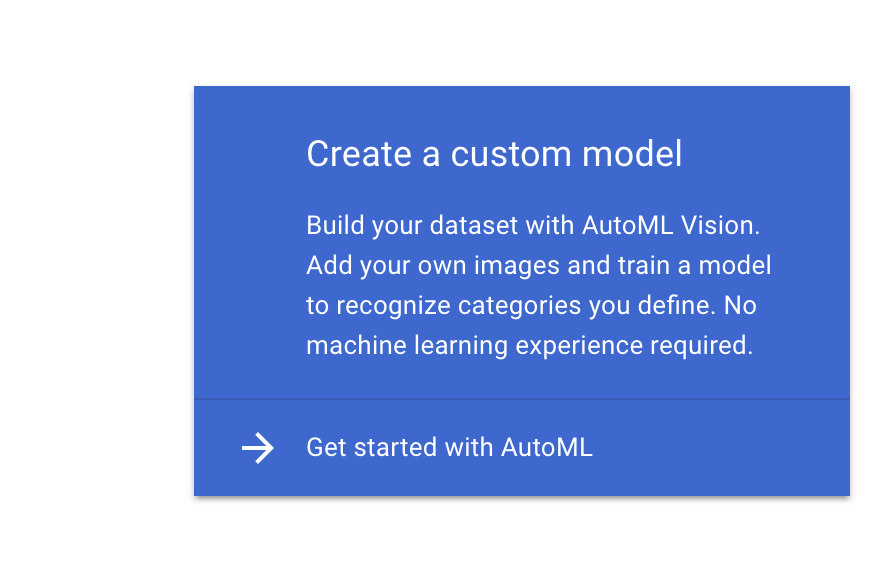

<aside class="special"><p><strong>Note: </strong>If you&#39;ve previously created a dataset with AutoML vision, you will see a list of datasets instead. In this case, click <strong>+ New Dataset</strong>.</p>
</aside>

Type "clouds" for the Dataset name.

Choose __Select a CSV file on Cloud Storage__ and enter the URL of the file you just uploaded - `gs://your-project-name-vcm/data.csv`

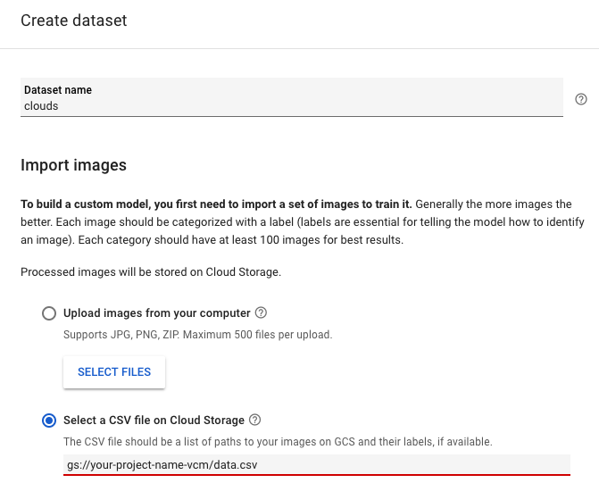

For this example, leave "enable multi-label classification" unchecked. In your own projects, you may want to check this box if you want to assign multiple labels per image.


Select __Create Dataset__.


It will take around 2 minutes for your images to finish importing. Once the import has completed, you'll be brought to a page with all the images in your dataset.


## Inspect images


__Step 1__

After the import completes, you will see the Images tab.


Try filtering by different labels (i.e. click cumulus) to review the training images:

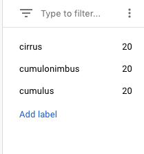

<aside class="special"><p><strong>Note: </strong>If you were building a production model, you&#39;d want <em>at least</em> 100 images per label to ensure high accuracy. This is just a demo so we only used 20 images so that our model will train quickly.</p>
</aside>

__Step 2__

If any image is labeled incorrectly you can click on them to switch the label or delete the image from your training set:


To see a summary of how many images you have for each label, click  __Label Stats__. You should see the following show up on the right side of your browser. Click __Close__.

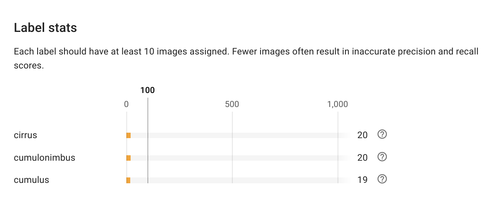

<aside class="special"><p><strong>Note: </strong>If you are working with a dataset that isn&#39;t already labeled, AutoML Vision provides an in-house human labeling service.</p>
</aside>


## Train your model


You're ready to start training your model! AutoML Vision handles this for you automatically, without requiring you to write any of the model code.

__Step 1__

To train your clouds model, go to the __Train__ tab and click __Start Training__.

Enter a name for your model, or use the default auto-generated name, and click __Start Training__.

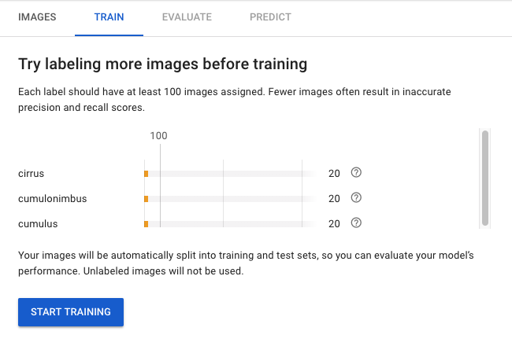

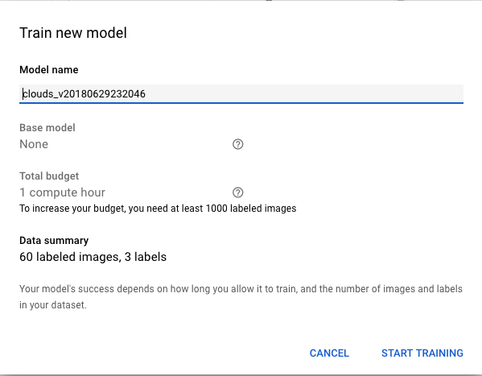

Since this is a small dataset, it will only take around __5 minutes__ to complete.


## Evaluate your model


__Step 1__

In the __Evaluate__ tab, you'll see information about AUC, precision and recall of the model.


You can also play around with __Score threshold__:

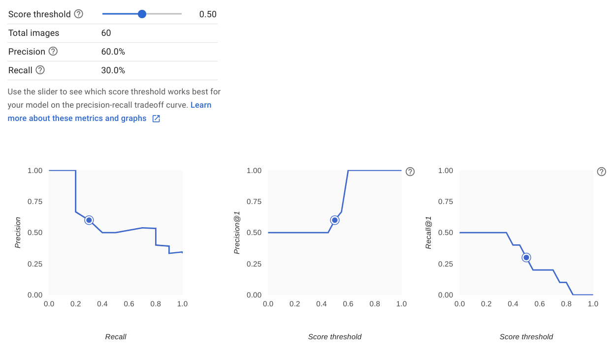

Finally, scroll down to take a look at the __Confusion matrix__.

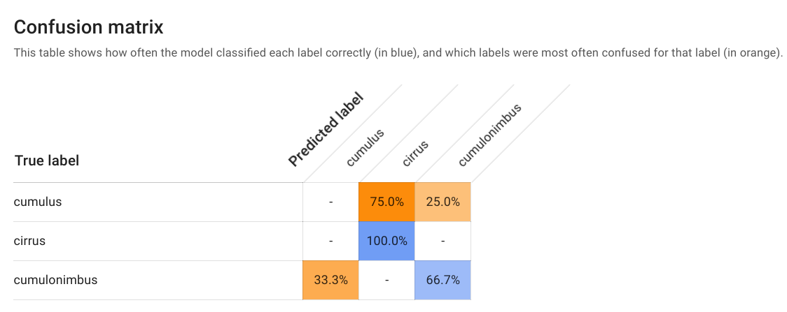

All of this provides some common machine learning metrics to evaluate your model accuracy and see where you can improve your training data. Since the focus for this lab was not on accuracy, skip to the prediction section, but feel free to browse the accuracy metrics on your own.


## Generate predictions


Now it's time for the most important part: generating predictions on your trained model using data it hasn't seen before.

__Step 1__

Navigate to the __Predict__ tab in the AutoML UI:

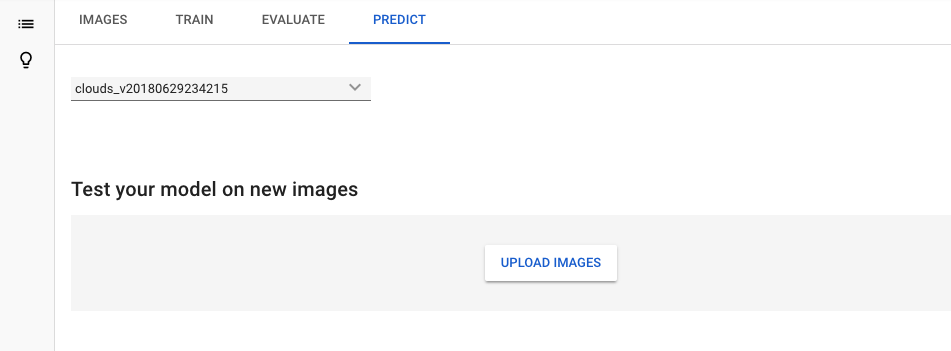

There are a few ways to generate predictions. In this lab, you'll use the UI to upload images. You'll see how your model does classifying these two images (the first is a cirrus cloud, the second is a cumulonimbus).

__Step 2__

Download these images by right-clicking on each of them:

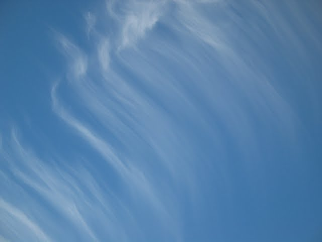

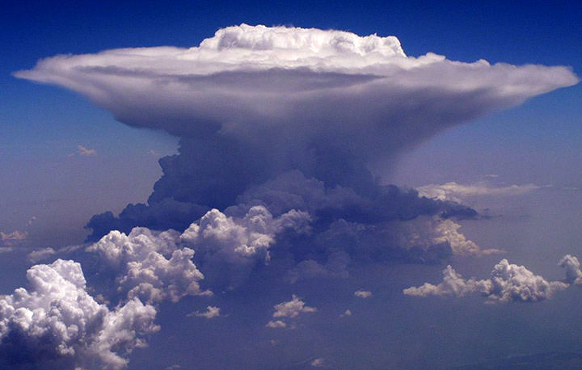

__Step 3__

Return to the UI, select __upload images__ and upload them to the online prediction UI. When the prediction request completes you should see something like the following:

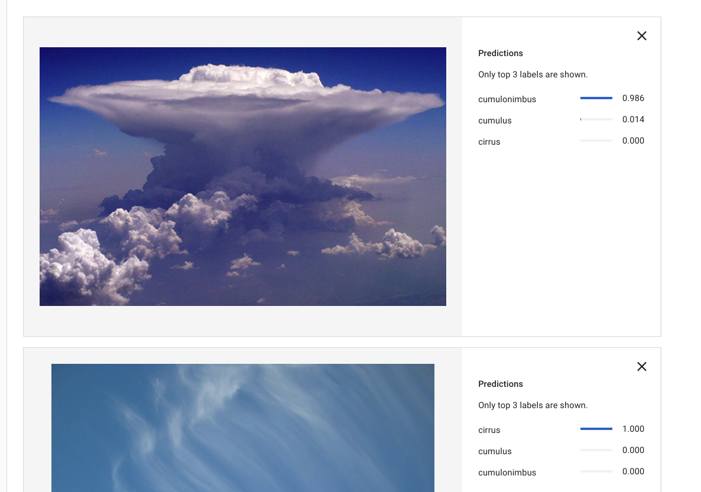

Pretty cool - the model classified each type of cloud correctly! Does your trained model do better than the 57% CIRRUS cloud above?

<aside class="special"><p><strong>Note:</strong> In addition to generating predictions in the AutoML UI, you can also use the REST API or the Python client to make prediction requests on your trained model. Check out the tabs for each to see some sample code. You can try it out by copy/pasting these commands into Cloud Shell and providing an image URL.</p>
</aside>

![[/fragments/endqwiklab]]

##### Manual Last Updated: May 7, 2019

##### Lab Last Tested: May 7, 2019

![[/fragments/copyright]]
